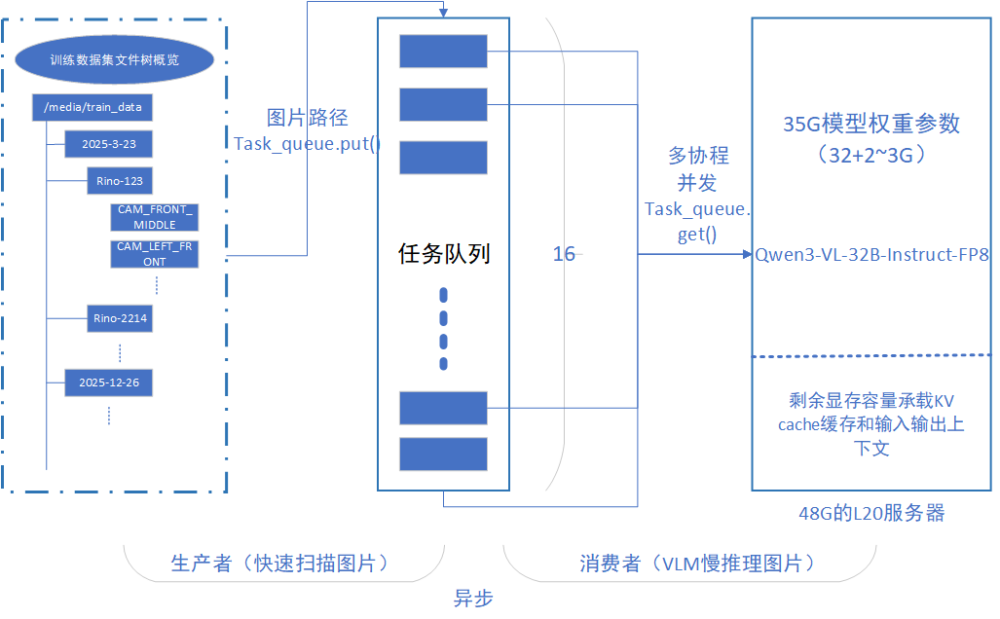

# 雨雾天气图片数据挖掘
[简易PPT](https://vlm.chenweijie.top)
### 背景：

公司在参加2025年12月末的一个物流车比赛时在雨雾环节卡住，事后分析原因是激光雷达感知到了“虚影”，认为是障碍物就停下。mentor想找出目前数据集中的雨雾天气的图片，然后借此定位到激光雷达的点云数据进行加强训练，这个查找的任务交给了我

### 方案：

mentor提示可以使用多个视觉语言大模型来做交叉验证

在modelscope上查看了一些模型大小后决定先使用Qwen3-VL-4B在本地对几张图片进行实验，后来跑通了发现描述基本准确可信，便在48G显存的L20服务器上部署更大模型进行调试应用

**具体细节**：



核心概念：

- 协程
- 任务
- 事件循环

4B模型单张图片测试

```bash
curl http://127.0.0.1:8000/v1/chat/completions \
  -H "Content-Type: application/json" \
  -d '{
    "model": "./Qwen3-VL-4B-Instruct",
    "messages": [{
      "role": "user",
      "content": [
        {"type": "text", "text": "这张图里有雨或雾吗？只回答有/无"},
        {"type": "image_url", "image_url": {"url": "file:///media/train_data/multi_data_20250825/rino-123-20250821/samples_third_ann_data/clip_rino_123-20250821_65/CAM_FRONT_MIDDLE/1755249776.675230.jpg"}}
      ]
    }],
    "max_tokens": 10,
    "temperature": 0.0
}'
```

旧版启动命令

```python
python -m vllm.entrypoints.openai.api_server \
    --model ./Qwen3-VL-32B-Instruct-FP8 \
    --max-model-len 4096 \
    --gpu-memory-utilization 0.75 \
    --port 8000 \
    --allowed-local-media-path /media/
```

**新版启动命令**

```python
vllm serve ./Qwen3-VL-32B-Instruct-FP8 
```

参考链接：

[vLLM部署模型](https://recipes.vllm.ai/Qwen/Qwen3-VL-30B-A3B-Instruct)

[Qwen3-VL-Github](https://github.com/QwenLM/Qwen3-VL#3)

